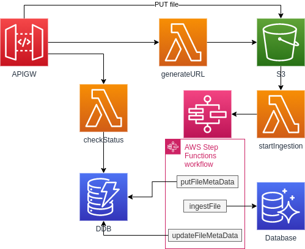

## File Upload and Ingestion Workflow

Allows apps to upload files to be ingested into database systems.

Provides an endpoint for checking file ingestion status.

1. Presigned URL is generated
1. App uploads file using URL
1. S3 invokes a Lambda which starts a StepFunction with event details
1. Step function puts ingestion metadata into a DynamoDB table
1. Step function loads file into database of choice
1. Step function updates ingestion metadata with finished timestamp

